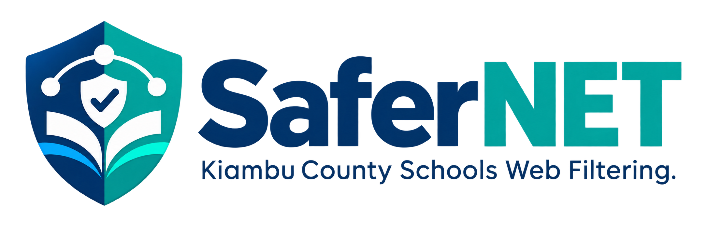

<p align="center">
  
</p>

<h1 align="center">SaferNET</h1>

<p align="center">
  <strong>Digital Safeguarding, DNS Filtering, and Classroom Telemetry for K–12 Schools</strong><br>
  <em>Official Platform for the Kiambu County Directorate of Education (CDE), Kenya</em>
</p>

<p align="center">
  <a href="docs/architecture.md"></a>
  <a href="docs/security-and-compliance.md"></a>
  <a href="docs/testing.md"></a>
  <a href="docs/deployment.md"></a>
</p>

---

## Overview

**SaferNET** is an enterprise-grade digital safeguarding and content filtering ecosystem built to protect K–12 learners in primary and secondary school computer laboratories across Kiambu County. 

Rather than relying purely on browser extensions (which students can easily bypass by launching alternate browsers or terminal commands) or pure DNS gateways (which cannot inspect full URLs, enforce search engine SafeSearch, or track individual student sessions), SaferNET delivers a **coordinated dual-layer defense-in-depth architecture**:

1. **OS-Level Windows DNS Agent**: An unattended .NET 10 Windows Service bound to `127.0.0.1:53` that blocks harmful domains at the socket level across all browsers and native programs.
2. **Browser Extension (SaferNET Shield)**: A Manifest V3 extension providing hardware-accelerated Declarative Net Request (DNR) rules, forced SafeSearch, offline telemetry buffering, and learner PIN authentication.
3. **Central Governance Platform & Officer Portal**: A Laravel 13 & React 19 web application providing multi-tenant school administration, county-wide policy authoring, automated AI domain triage, incident investigation, and audit trails.

---

## Detailed Documentation

Comprehensive documentation is available in the [`docs/`](docs/) directory:

| Document | Description |
|---|---|
| 🏛️ **[System Architecture](docs/architecture.md)** | Full architectural breakdown, dual-layer filtering model, data flow, and threat model. |
| 🖥️ **[Windows Endpoint Agent](docs/agent.md)** | .NET 10 background service internals, DNS parsing, atomic cache resilience, and build/install guide. |
| 🛡️ **[SaferNET Shield Extension](docs/extension.md)** | Manifest V3 implementation, DNR dynamic rules, SafeSearch enforcement, and PIN session management. |
| 🚀 **[Deployment & Operations Guide](docs/deployment.md)** | Step-by-step production rollout, school onboarding, workstation provisioning, and disaster recovery. |
| 🔒 **[Security, Privacy & Compliance](docs/security-and-compliance.md)** | KDPA 2019 compliance, child data protection, bcrypt PIN hashing, and zero-log audit policies. |
| 🧪 **[Testing & Quality Assurance](docs/testing.md)** | Instructions for executing PHP, frontend/extension, and .NET agent test suites. |
| 📡 **[API Reference](docs/api-reference.md)** | REST API specification for client sync, telemetry ingestion, learner sessions, and domain review. |

---

## Key System Capabilities

- **Sub-Millisecond DNS Filtering**: Local in-memory domain matching with parent-suffix hierarchy walks (`*.badsite.example`).
- **Resilient Offline Protection**: Workstations persist encrypted/validated policy caches to disk (`%ProgramData%\SaferNET\policy.json`). If internet drops, workstations continue enforcing the latest policy without degradation.
- **Learner PIN Authentication**: Students authenticate directly at the workstation (`POST /api/v1/extension/sign-in`) with brute-force lockout protections, accurately attributing telemetry without teacher overhead.
- **Classroom Live Focus Mode**: Teachers can instantly lock laboratory workstations to specific learning domains or LMS portals during exams.
- **Automated AI Domain Triage**: Newly discovered student browsing destinations are prioritized and classified using county safety models, presenting categorized recommendations to education officers.
- **Tamper-Resistant Deployment**: GPO / Registry integration (`ExtensionInstallForcelist`) prevents students from disabling or uninstalling the browser extension.

---

## Quickstart & Local Development

### Prerequisites
- **PHP**: 8.4+ with `pdo_pgsql`, `intl`, `gd`, `zip`, `mbstring`
- **Database**: PostgreSQL 17+
- **Node.js**: v22+ & npm
- **.NET SDK**: 10.0+ (for Windows Agent)
- **PowerShell**: 7+ (pwsh)

### 1. Central Platform Setup
```bash
# Clone the repository
git clone https://github.com/isaacmuchunu/SaferNET.git
cd SaferNET

# Install dependencies
composer install
npm ci

# Configure environment
cp .env.example .env
php artisan key:generate

# Run migrations and seeders
php artisan migrate --seed

# Run the health doctor
php artisan safernet:doctor
```

### 2. Running Local Development Servers
```bash
# Start backend API and queue workers
php artisan serve

# In a separate terminal, start Vite for the Officer Portal
npm run dev
```

### 3. Building the Windows Agent & Extension
```powershell
# Run the agent test suite and package the release binary
pwsh ./agent/windows/build.ps1 -Runtime win-x64

# Audit and validate the browser extension
npm run check
```

---

## Essential Artisan Commands

| Command | Purpose |
|---|---|
| `php artisan safernet:doctor` | Validates database connectivity, PostgreSQL constraints, and directory permissions. |
| `php artisan safernet:enroll-device` | Registers a computer lab workstation with an asset tag and laboratory binding. |
| `php artisan safernet:issue-service-token` | Issues a cryptographically scoped bearer token for agent/extension sync. |
| `php artisan safernet:sync-blocklists` | Downloads and syncs external threat feeds and county blocklist repositories. |
| `php artisan safernet:triage-domains` | Executes background AI classification on unclassified web browsing traffic. |
| `php artisan safernet:expire-stale-components` | Marks disconnected workstations as degraded or offline. |

---

## Contributing & Development Principles

1. **Child Safeguarding First**: Attribution errors or policy bypasses are treated as critical security defects.
2. **Deterministic Attribution**: A student's browsing record must never be attributed to another learner. Sessions expire cleanly on sign-out.
3. **No Unmanaged Client Telemetry**: Telemetry is buffered in durable local storage and synchronized with idempotent UUIDs to avoid duplicates or missing records.
4. **Sole Project Contributor**: Author and committer is strictly `isaacmuchunu <isaacmuchunu@gmail.com>`.

---

## License

This software is developed for the **Kiambu County Directorate of Education**. All rights reserved.
