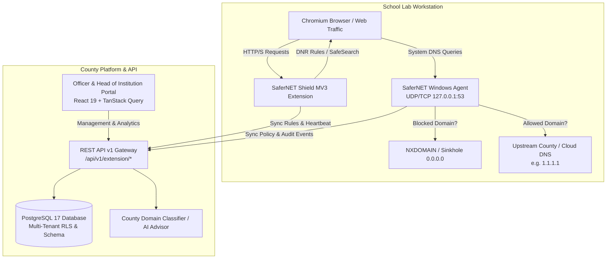

# SaferNET System Architecture

## 1. Executive Overview

**SaferNET** is the centralized digital safeguarding, network filtering, and classroom management platform developed for the **Kiambu County Directorate of Education (CDE)**. It protects K–12 learners in primary and secondary schools across public and private educational computer laboratories from inappropriate, harmful, or illegal online content while maintaining real-time governance, transparent policy synchronization, and reliable auditing.

The platform employs a **defense-in-depth, dual-layer filtering model**:
1. **Operating System Layer (Windows DNS Filter Agent)**: An unattended .NET Windows service binding loopback UDP/TCP port 53. It enforces domain policies at the operating system level, capturing all network traffic regardless of which browser or native client is executed.
2. **Browser Layer (SaferNET Shield Manifest V3 Extension)**: A Chrome / Chromium extension running Declarative Net Request (DNR) dynamic rule enforcement, local URL pattern inspection, forced SafeSearch enforcement, real-time classroom telemetry, learner PIN authentication, and focus mode locking.
3. **Central Governance Layer (SaferNET Management Platform & Officer Portal)**: A high-performance Laravel 13 backend and React 19 single-page application enabling multi-tenant school administration, county-wide policy authoring, automated domain triage, incident investigation, and audit trails.

---

## 2. High-Level Architecture Diagram

---

## 3. Core Architectural Components

### 3.1 Central Platform (Backend)
- **Framework**: Laravel 13 running on PHP 8.4+ with PostgreSQL 17.
- **Multi-Tenancy & RBAC**:
  - Strict tenant separation anchored by `institution_id` on all operational tables (`devices`, `learners`, `web_events`, `incidents`, `audit_logs`).
  - **Roles**:
    - **County Director of Education (CDE)** & **Sub-County Director (SCDE)**: County-wide visibility, global blocklists, cross-school analytics, AI domain triage, policy approval.
    - **Head of Institution (HOI)**: School-level dashboard, device inventory, learner roster, lab workstation assignment, temporary policy exception requests.
    - **Service Token / Agent**: Device-bound identity authorized solely for telemetry ingestion, policy download, and workstation session binding.
- **Effective Policy Engine**: Resolves county baseline rules, sub-county overrides, and school-specific categories into a unified cryptographic policy version hash (`content_hash`) with strict deduplication and capacity flags.

### 3.2 Endpoint Windows Agent
- **Runtime**: Native .NET 10 Windows Service (`SaferNet.Agent.exe`).
- **Networking**: Binds to `127.0.0.1:53` (UDP and TCP) as the workstation's local resolver. It evaluates DNS requests in sub-millisecond lookups against memory-indexed hash tables and parent-domain tree walks (e.g., wildcard matching `*.badsite.example`).
- **Resilience**:
  - **Local Disk Cache**: Retains the latest known policy at `%ProgramData%\SaferNET\policy.json` to sustain enforcement during internet interruptions.
  - **Atomic Safe Writes**: Updates policy cache using atomic file swaps to eliminate corruption on hard reboots.
  - **Graceful Fail-Safe**: If the agent service cannot bind or start, the installer ensures system DNS remains untouched or falls back to standard DNS rather than creating a silent networking outage.

### 3.3 Browser Extension (SaferNET Shield)
- **Architecture**: Chrome Manifest V3 service worker (`background.js`), content injection script, policy options manager, and modern responsive block screen (`blocked.html`).
- **Enforcement Mechanisms**:
  - **Declarative Net Request (DNR)**: In-engine hardware-accelerated rule evaluation for ultra-fast domain blocking before network dispatch.
  - **Strict SafeSearch**: Automatically injects forced SafeSearch parameters across Google, Bing, DuckDuckGo, and YouTube (`safe=strict`, `forcesafesearch`).
  - **Classroom Control (Focus Mode)**: Locks student browsers to approved educational origins during supervised classroom instruction or assessments.
  - **Tamper Resistance**: Machine-level deployment via Windows Group Policy / Registry `ExtensionInstallForcelist` greys out "Remove" and "Disable" buttons in Chrome.

---

## 4. Multi-Tenant Data Isolation & Security

1. **Foreign Key Boundaries**: Composite foreign keys enforce that devices, learners, and laboratory assignments never cross institution boundaries.
2. **Service Token Scoping**: Sanctum tokens issued to agent or extension clients are tied to a specific `institution_id` with `telemetry:write` permissions and cannot access portal admin APIs.
3. **Audit Trail Immutability**: All security actions, policy exceptions, and login attempts produce tamper-evident `audit_logs` records. Sensitive inputs (such as student PINs) are filtered and never persisted in log payloads.
